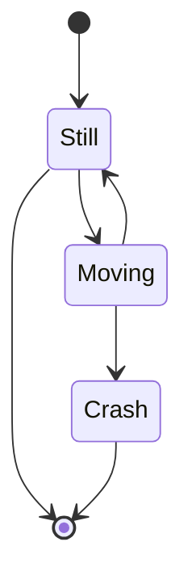

```dataview
TABLE WITHOUT ID file.frontmatter AS "Note Properties"
WHERE file.name = this.file.name
```

> [!mark.orange] Mobile support is a work in progress

This is a note that is used to test themes (built for universal), custom CSS, plugins, and anything else you might use in Obsidian. Use this note to showcase all the elements used in Obsidian Markdown! Feel free to add anything to this note and keep it in your vault for the future! It can be used in light and/or dark themes!

This note also serves as a manual on using each of the elements displayed. It is easy to switch between the editor/source view and the reading view to see how the element was generated and how it will appear when rendered!

Before you jump into all the content of this note, it is worth mentioning the [Obsidian Help](https://help.obsidian.md/) site. It is incredibly helpful when you have questions about *how* ... to do something in your note. The community forum and support pages are worth a view as well.

***

# Headings

There are a total of 6 levels of headings supported in Obsidian. More levels *can* be used with customization, but only 6 levels will be shown in the outline.

# Heading 1

## Heading 2

### Heading 3

#### Heading 4

##### Heading 5

###### Heading 6

***

# Typography

Obsidian can support a variety of typography features. Text can be shown in:

- *italic*
- **bold**
- ***bold italics***
- ~~strikethrough~~
- *~~italic strikethrough~~*
- **~~bold strikethrough~~**
- ***~~bold italic strikethrough~~***

> [!note]
> You might wonder, "what about underline"?
> 
> Historically in print, underlined text might have been used to create emphasis. This was used largely due to typewriters not having keys specific for italic characters. Typewriters *did* have the ability to underline. Italic characters would have required an entire extra set of keys.
> 
> In the modern digital world, it is much easier to make text bold, italic, colored, etc ... This combined with the common use of underlines representing links, meant that we interpret underline with a different context compared to print. For this, the Markdown specification does *not* feature underline for typography.

## Superscript & Subscript

Obsidian does not support superscripts and subscripts natively. This feature is provided by the [LaTeX Suite](https://github.com/artisticat1/obsidian-latex-suite) plugin. If you do not have it enabled, you can ignore this section!

- $\large H_2O$
- $\large X^2 = 5 + 3$
- $\large V_{\small RMS}^2$ or $\large V^2_{\small RMS}$

These examples are only a small demonstration of the capabilities. Consult the LaTeX documentation for more information. [Overleaf](https://www.overleaf.com/learn/latex/Learn_LaTeX_in_30_minutes) has a good "30 minute" tutorial on learning LaTeX.

***

# Abbreviations

Abbreviations and acronyms are provided via the plugin [Abbreviations and Acronyms](https://github.com/dragonish/obsidian-abbreviations). If you look in the note's metadata/properties, you can see the syntax for the abbreviations. Something like HTML or CSS. Just hover over those terms and the tooltip will be the definition.

> [!warning]
> At the time of writing, the plugin is at v1.7.2 and exhibits a strange behavior. When checking a task in a list, the screen scrolls away from the object being clicked. It seems to be related to this plugin. The vault was tested using the default theme, with no other plugins or CSS customizations applied. The behavior is not present with the plugin disabled!

***

# Blockquotes

> Block quotes are also supported! This is a basic blockquote. In the next section, you'll see the Callouts. They are customized blockquotes with extra styling, icon support, and a special syntax.
> 
> This is just a new paragraph in the blockquote. It is to demonstrate the styling of the blockquote.

***

# Callouts

Callouts are special blockquotes that have additional styling. Callouts have a title, icon, and content areas. They can also be different colors or just have different styling in general. There are several types of Callouts.

## Built-ins

The following Callouts are all built-in to Obsidian.

> [!note]
> This is a `note` callout.

> [!abstract]
> This is an `abstract` callout. It also has the aliases `summary` & `tldr`.

> [!info]
> This is an `info` callout.

> [!todo]
> This is a `todo` callout.

> [!tip]
> This is a `tip` callout. It also has the aliases `hint` & `important`.

> [!success]
> This is a `success` callout. It also has the aliases `check` & `done`.

> [!question]
> This is a `question` callout. It also has the aliases `help` & `faq`.

> [!warning]
> This is a `warning` callout. It also has the aliases `caution` & `attention`.

> [!failure]
> This is a `failure` callout. It also has the aliases `fail` & `missing`.

> [!danger]
> This is a `danger` callout. It also has the alias `error`.

> [!bug]
> This is a `bug` callout.

> [!example]
> This is an `example` callout.

> [!quote]
> This is a `quote` callout. It also has the alias `cite`.

## Custom

The following Callouts are completely custom. If you do not have any stylesheets to support these, they'll appear as `note` callouts.

> [!wip]
> This is a `wip` custom callout.

> [!terminal]
> This is a `terminal` callout.

> [!fixme]
> This is a `fixme` callout.

> [!ghost]
> This is a `ghost` callout.

> [!calendar]
> This is a `calendar` callout.

### Inline

The following Callouts are custom inline Callouts. They are meant to be single line with short content. Some of them have special effects used for various purposes.

> [!inline:]
> This is an `inline` callout.

> [!part:]
> This is a `part` inline callout.

> [!key:]
> This is a `key` inline callout. It becomes clear when you hover over the content.

> [!note]
> If you are using the `universal` snippets from my repository, The `key` callout also prevents copying the key when it is part of a larger selection of the document. Text in the key can be copied only when the content is being hovered. Keyboard shortcuts vs mouse interaction allows more control over *what* is copied.
>
> - Select some text inside the `key` callout, copy and paste it into a blank note (text file).
> - If you are not hovering the content when you copy, it will not be selected.
> - Select text before and after the `key` callout, copy and paste into the blank note.
> - If you are not hovering the content of the `key` callout when you copy, it will not be selected.

### Marks

The following Callouts are custom inline Callouts. They are narrow, with tight margins, and a ribbon that is persistently on the left of the screen. They are meant to act as a bookmark in the note. (This requires special CSS customizations.)

> [!mark]
> This is a `mark` callout. The default color is red, but other colors are available.

> [!mark.red]
> This is a `mark.red` callout.

> [!mark.yellow]
> This is a `mark.yellow` callout.

> [!mark.orange]
> This is a `mark.orange` callout.

> [!mark.green]
> This is a `mark.green` callout.

> [!mark.blue]
> This is a `mark.blue` callout.

> [!mark.purple]
> This is a `mark.purple` callout.

> [!mark.pink]
> This is a `mark.pink` callout.

> [!mark.dark]
> This is a `mark.dark` callout.

> [!mark.light]
> This is a `mark.light` callout.

## Folding Callouts

Callouts can be folded. It is a simple change in the syntax. They can start in an open or closed state.

> [!note]- This callout is folded by default
> Here is the rest of the content for the callout.

> [!note]+ This callout is not folded by default
> Here is the rest of the content for the callout.

The custom Callouts above can be folded too (even the Inline Callouts)!

> [!inline:]-
> Here is the content that is folded by default.

> [!key:]-
> Here is a folded `key` inline callout.

## Nesting Callouts

All Callouts can be nested within another (most elements in Obsidian can be nested).

> [!info]
> Here is an `info` callout with a nested callout.
> > [!terminal]
> > This is a nested `terminal` callout.

***

# Code

Code and code blocks are essential elements for a number of documents. Obsidian supports inline code and code blocks.

An example of `inline code` is seen here. The text is formatted and parsed differently than standard text. Take a **bold** bit of text and put in an inline code element. Something like `**bold**` this.

Code blocks are meant for multi-line code or text. They also support language-specific syntax highlighting. For example, here is some JSON vs plaintext:

```json
{
	"first_key": "first_value",
	"second_key": "second_value"
}
```

```
{
	"first_key": "first_value",
	"second_key": "second_value"
}
```

***

# Emojis

Emojis are supported, but not the friendliest to use. On Windows, you can press <kbd>WIN + .</kbd> to open the emoji selector. Emoji shortcodes are provided by [Emoji Autocomplete](https://github.com/KraXen72/obsidian-emoji-autocomplete). Simple smileys like ❤️ and 😄 are easy enough to add by typing something like `:heart:`!

***

# Footnotes

Footnotes are supported in Obsidian[^1]. Just use the basic syntax `[^1]` to establish the footnote (replacing the number for the correct reference). After making the footnote reference, a dialog pops up allowing you to enter the content for the footnote. Obsidian then sends the content to the bottom of the note!

***

# Highlight

Sometimes it can be helpful to highlight certain text. ==This is a very important sentence!== It can be done using a simple syntax. By default, the highlight color is yellow. Only one color is supported natively.

***

# Horizontal Rules

Horizontal Rules can help make the document more readable by separating sections of a note. The basic rule is good, but leaves a little to be desired. Unfortunately, there is no easy way to add new rules without a plugin. This means any custom rules have to be created in HTML.

## Dashed

<hr class="hr-dashed"/>

## Dots

<hr class="hr-dots"/>

## Fancy

<hr class="hr-fancy"/>

## Rainbow

<hr class="hr-rainbow"/>

***

# Images

Not all content is text, lists, tables, and links! Sometimes you need/want to add an image of something. This is easy to do in Obsidian. You can copy and paste an image directly into the note and Obsidian will add it to your vault in an attachments folder. You can drag and drop instead. You can also directly add files into the vault and manually link to it. As always, check the [Obsidian Help - Images](https://help.obsidian.md/style-guide#Images) page for more information. Here is an example:

![[Pasted image 20250813213557.png]]

You can add captions and alternate text if you use a plugin like [Image Captions](https://github.com/alangrainger/obsidian-image-captions). Something like this ...

![[Pasted image 20250813213557.png | With a caption]]

***

# Keyboard

Sometimes, it can be helpful to show keyboard shortcuts. Obsidian doesn't support them natively, but with custom CSS, they are made to look more noticeable and distinguishable from normal code blocks.

Unfortunately, Markdown does not have a common/standard way to add keyboard elements. The only supported way for now is to use raw HTML. You can add a <kbd>shift</kbd> key in the middle of a sentence to see it displayed like a key on the keyboard.

***

# Links

Links are pretty important! They can make it easier to navigate between notes, send the reader to external reference sites, provide context and resources without making the note bigger, etc ... Of course, there *is* a proper way to use links. Check the [Obsidian documentation](https://help.obsidian.md/links) for more information.

## Internal

Internal links are those that do *not* reach outside of Obsidian. They link to other files and notes within the vault or file system. They can be either the traditional Markdown syntax or the Wikilinks format. Here are some examples of internal links (they all link to *this* note and they are all in the Wikilinks format).

- [[Obsidian Test Note]]
- [[Obsidian Test Note | Alternate Name for Obsidian Test Note]]
- [[Obsidian Test Note#Links]]

Notice how all of the links do *not* have the "external" icon next to them. You may also notice that when you hover an internal link you are given a preview of the file/note! That makes things easier when reading through a dense document. You never have to leave the note you're in to see the file or note being linked!

## External

External links redirect the user to the address linked. Anything on the web or outside of Obsidian is considered external. They use the Markdown link format always. Here are some examples (all links below will redirect you to the Obsidian Help page on links or images):

- [Obsidian Help - Links](https://help.obsidian.md/links)
- [Obsidian Help - Links - Supported formats for internal links](https://help.obsidian.md/links#Supported+formats+for+internal+links)

Notice how both links have an icon at the end? This is to let you know they are external.

## With Images

Images can also be made into links. See the [[Obsidian Test Note#Images]] section above for more information on how to add images. Here is a very simple example of an image (from the [[Obsidian Test Note#Images | Images]] section above) that is also a link:

[![[Pasted image 20250813213557.png]]](https://help.obsidian.md/style-guide#Images)

... and with a caption ...

[![[Pasted image 20250813213557.png | Obsidian]]](https://help.obsidian.md/style-guide#Images)

***

# Lists

Lists are supported in Obsidian. They can be unordered (no numbers) or ordered (numbers). Lists can also be nested within lists or other elements.

## Unordered

- First list item
- Second list item
- Third list item
- Fourth List Item

## Ordered

1. First list item
2. Second list item
3. Third list item
4. Fourth list item

## Nested

1. Start with a list (ordered or unordered)
	1. Then add a new item but tabbed over
	2. A second item
2. Then <kbd>SHIFT + TAB</kbd> to go back to the original list

## Checklists

Obsidian also supports a special kind of list, the check/task list! This is still just a list, but with an interactive box that can be checked/unchecked in the reader view. The syntax is a minor change to a traditional unordered or ordered list. Look at these examples:

### Unordered Checklist:

- [ ] First unordered task
- [ ] Second unordered task

### Ordered Checklist:

1. [ ] First ordered task
2. [ ] Second ordered task
3. [ ] Third ordered task

> [!tip]
> Look at the note in reader view and source view to see the difference between a completed task and one that is not. The state of the task can be changed in either view rather simply!

## Fancy Lists

The fancy list items are possible through custom CSS. If you are using vanilla Obsidian (no plugins or custom CSS snippets), you won't have support for these. They will appear and behave as normal task/list items. If you use a theme or have custom CSS snippets that support them, they'll appear and behave a bit differently!

### Interactive Checkboxes

- [ ] Normal checkbox
- [x] Completed checkbox

### Icons only

- [/] Incomplete icon
- [-] Canceled icon
- [>] Forwarded icon
- [<] Scheduling (calendar) icon
- [?] Question icon
- [!] Important icon
- [.] Circle Check icon
- [*] Star icon
- [@] At icon
- [f] File Icon
- [p] Puzzle Icon
- ["] Quote icon
- [l] Location icon
- [L] Lego icon
- [b] Bookmark icon
- [i] Information icon
- [I] Idea (light bulb) icon
- [k] Key icon
- [u] Up (trend up) icon
- [d] Down (trend down) icon
- [+] Plus (add) icon
- [=] Equal (similar) icon
- [~] Infinity icon
- [C] Copyright icon
- [z] Lightning bolt icon
- [g] Git icon
- [a] letter a
- [t] letter t
- [q] QR Code icon
- [h] HREF Link icon

#### Numbers

- [0] Number 0
- [1] Number 1
- [2] Number 2
- [3] Number 3
- [4] Number 4
- [5] Number 5
- [6] Number 6
- [7] Number 7
- [8] Number 8
- [9] Number 9

***

# Mermaid Charts & Diagrams

> [!mark.red] Full implementation needed



***

# Tables

Tables in Markdown are a bit awkward at the best of times. A plugin like [Advanced Tables](https://github.com/tgrosinger/advanced-tables-obsidian) can make a huge difference when editing tables. The idea is simple enough. Just make a text based table and Obsidian will render it into a nice looking table!

| Header 1    | Header 2                          | Header 3 |
| ----------- | --------------------------------- | -------- |
| First Item  | Some value                        | 0        |
| Second Item | Some more information can go here | 10       |
| Third Item  | False                             | 20       |

Unfortunately, things like merged columns and rows is not supported, but the syntax allows for column alignment. See the following table and view it in editor mode to see the difference.

| Header 1                   | Header 2 |                     Header 3 |
|:-------------------------- |:--------:| ----------------------------:|
| First Item is left aligned |  Center  | This column is right aligned |
| Second                     |    0     |                         See? | 

The styling for tables is a bit bland in the default theme. If you want different colors or alternate row shading, you'll have to add some custom CSS.

[^1]: See the docs for more information [here](https://help.obsidian.md/syntax#Footnotes)
