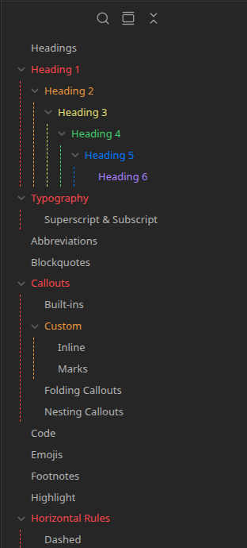

# snippets

A set of automation tools for Obsidian snippet switching.

## universal

> [!note]
> This branch is a work in progress.

This branch of the repository contains CSS stylesheets that *should* be universal with any theme. It does not attempt to be a theme on its own but does have some elements that set styles. This integration is meant to work using the Obsidian namespace for CSS, so it should be widely universal.

## CSS Snippets

All snippets in this branch are meant to be independent of the specific theme in use in your vault. The theme you have enabled may have styles set for things other than color. If you are using a theme that makes major alterations to sizing and position of any rendered element, the snippets in this branch may conflict with the intended look and feel of your theme.

### Features

> [!info] Your mileage may vary
> The snippets in this branch were built using the default theme for Obsidian. Some of the snippets support community plugins. Not everything here will be useful to you! Some of might not work quite right either!

1. Colored headings (H1-H6) in the outline for readability and convenience.

    

2. work in progress

#### Plugins

> [!warning] Work in progress

## Mobile Support

The mobile support for the universal branch is an ongoing project. Different device sizes and color schemes make it difficult to find a good solution.

Git support for mobile is a mixed bag as well. Android users may have an easier time finding apps or support for easy repo copying. iOS users can use an app like a-shell with a bit of automation to help with managing the repo.

## Installation

Installation of this repository (any branch) is simple.

- Clone the repository `git clone https://github.com/jemberton/snippets.git`
- Checkout the branch you want to use `git checkout <branch_name>`
- Run the `obsidian-snippets.sh` script
- Enter the vault path and images path when prompted
- Enable the desired snippets in Obsidian by going to `Settings > Appearance`
- Open the test note and make sure everything looks correct

## Updating

If you have made any changes to the local repository, you might want to backup your changes before updating. Any/all changes **will be** lost! If you want to make significant changes, it is best to fork the repo rather than clone. If you fork the repo rather than clone, you will need to manage the merges yourself. The following instructions are for those who just clones the repo.

- Update the local repository as normal with `git pull` for the selected branch.
- Run the `obsidian-snippets.sh` script

## Issues

If you experience any issues, it is advised to disable all plugins and revert back to the default theme in order to troubleshoot or identify the root cause. If you think you have found something that is related to the snippets in this repository, please [create an issue](https://github.com/jemberton/snippets/issues).
